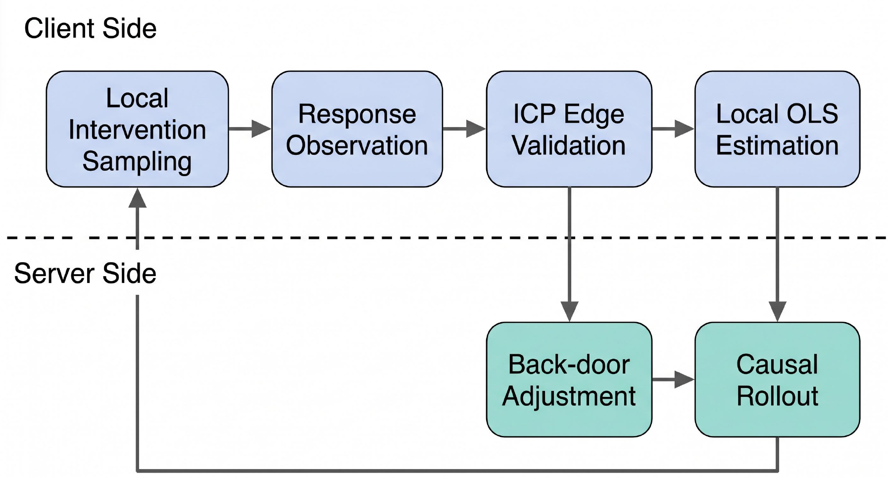
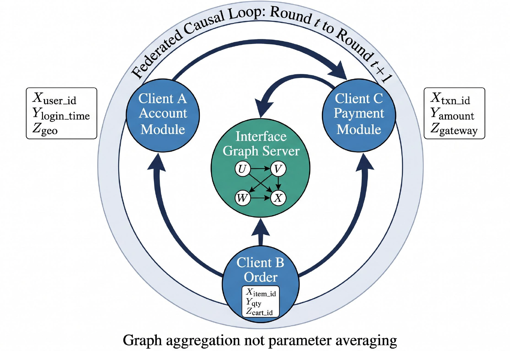
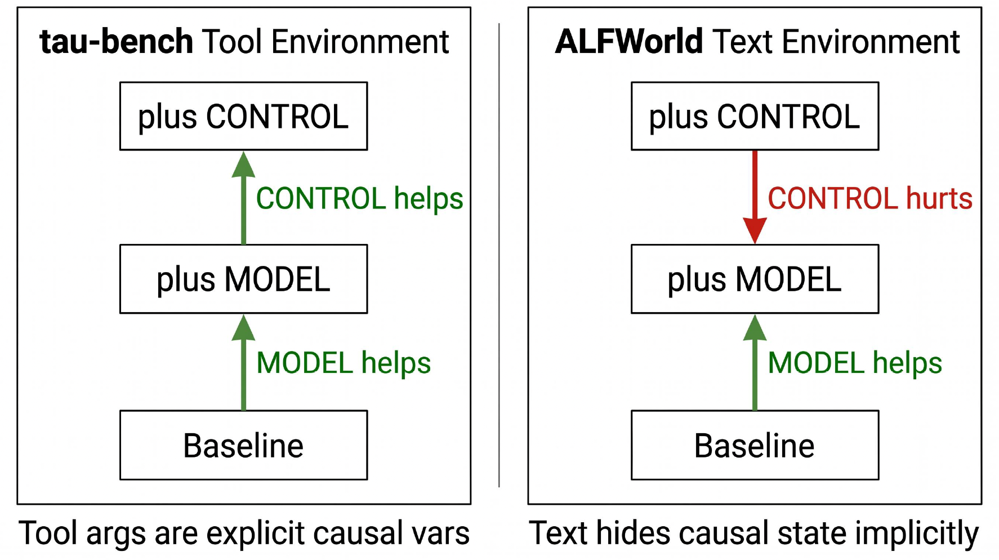
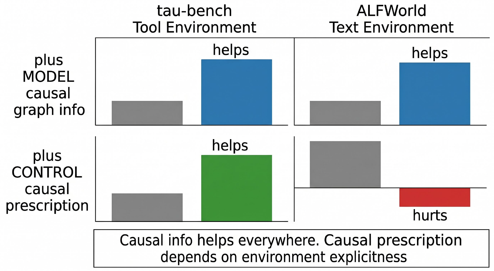

<h1 align="center">FedCausalWorld</h1>

<p align="center">
  <strong>Federated Causal World Models for Agentic LLMs</strong>
</p>

<p align="center">
  <a href="LICENSE"></a>
  <a href="requirements.txt"></a>
</p>

<p align="center">
  <strong>Anonymous code release for the FedCausalWorld manuscript.</strong>
</p>

<p align="center">
  <a href="#overview">Overview</a> |
  <a href="#method">Method</a> |
  <a href="#quick-start">Quick Start</a> |
  <a href="#benchmarks">Benchmarks</a> |
  <a href="#citation">Citation</a>
</p>

> **TL;DR.** FedCausalWorld studies whether multiple private clients can
> compose a shared causal world model for tool-using LLM agents without
> centralizing local trajectories. Clients validate intervention-response
> structure locally; the server aggregates causal graph information, performs
> causal adjustment/rollout, and returns decentralized control signals for
> downstream agent planning.

<p align="center">
  
</p>
<p align="center">
  <em>Figure 1. FedCausalWorld pipeline: local intervention sampling and edge validation feed server-side adjustment and causal rollout.</em>
</p>

## Repository Summary

- **Scope.** Can private clients compose a shared causal world model for tool-using agents without centralizing trajectories?
- **Method.** FedCausalWorld validates local intervention-response structure and aggregates causal graph information for decentralized control.
- **Contents.** Federated causal modules, tau-bench and ALFWorld experiments, baselines, outputs, and reproducibility notes.

## Overview

Modern tool-using agents operate over modular worlds: account systems,
payment gateways, inventory modules, text environments, household simulators,
and other partially observed components. A purely sequential world model can
learn correlations in these traces, but those correlations often fail under
client heterogeneity, latent confounding, and distribution shift.

FedCausalWorld frames world-model sharing as **federated causal graph
composition**. Each client keeps its private interaction data local, estimates
candidate causal relations from interventions and responses, and shares only
validated interface structure. The server composes those structures into a
global causal world model used for planning, rollout, and prompt-level control.

This repository contains:

- A six-step **FedCausalCompose** pipeline for local module discovery,
  interface validation, causal graph composition, and decentralized control.
- Synthetic structural causal model (SCM) experiments for theory checks,
  including confounder shift, ICP validation, horizon scaling, and
  do-calculus non-identifiability.
- Agentic evaluation drivers for **tau-bench Retail**, **tau-bench Airline**,
  and **ALFWorld**.
- Multi-seed reproducibility scripts for studying variance in hosted LLM-agent
  benchmarks.

## Method

FedCausalWorld separates graph aggregation from parameter averaging. Clients
estimate local causal modules and intervention-response edges; the server
aggregates stable interface structure rather than raw data or model weights.

<p align="center">
  
</p>
<p align="center">
  <em>Figure 2. Federated causal loop across modular clients and an interface graph server.</em>
</p>

The core implementation in `src/fed_causal/pipeline.py` follows six steps:

1. **Local module identification**: define local state variables, actions, and
   incoming/outgoing interface events.
2. **Interface discovery**: propose cross-module edges from temporally matched
   outgoing and incoming events.
3. **Distributed intervention matching**: match `do(.)` events to downstream
   responses while tracking `N_min`, `q_hat`, `r_hat`, and verification
   probability.
4. **Cross-module edge validation**: retain edges that pass the
   intervention-response verification threshold.
5. **Causal composition**: compose a directed interface graph and perform
   topological causal rollout.
6. **Decentralized causal control**: emit module-level upstream/downstream
   constraints for agent planning.

## Empirical Takeaways

The repository is designed to test when causal world-model information helps
and when prescriptive control can be brittle. In tool environments with
explicit arguments, causal control can improve downstream decisions; in text
environments where causal state is implicit, the same control signal can be
less reliable.

<p align="center">
  
</p>
<p align="center">
  <em>Figure 3. Causal graph information and causal control behave differently in explicit tool environments and implicit text environments.</em>
</p>

<p align="center">
  
</p>
<p align="center">
  <em>Figure 4. High-level finding: causal information helps broadly, while causal prescription depends on environment explicitness.</em>
</p>

## Repository Structure

```text
fedcausalworld/
├── README.md
├── LICENSE
├── requirements.txt
├── fig1_pipeline_v2.png
├── fig2_federated_loop_v2.png
├── fig3_causal_control_v2.png
├── fig4_intuition_v2.png
├── src/fed_causal/
│   ├── synthetic_scm_skeleton.py      # Synthetic SCM generator
│   ├── pipeline.py                    # Six-step FedCausalCompose pipeline
│   ├── event_traces.py                # Event-trace utilities
│   ├── metrics.py                     # Task metrics and CIs
│   ├── llm_client.py                  # OpenAI-compatible chat wrapper
│   └── baselines/                     # B0-B11 baseline prompts/models
├── experiments/
│   ├── anchor4_v5_icp.py              # ICP edge-validation check
│   ├── anchor4_v9_b10fix.py           # Confounder-shift oracle check
│   ├── anchor4_v10_horizon.py         # Horizon scaling check
│   ├── p11_taubench_3seed.py          # tau-bench Retail multi-seed run
│   ├── p12_alf_3seed_v2.py            # ALFWorld multi-seed run
│   ├── p13_b8e_icp.py                 # ICP-validated framing test
│   ├── p14_federated_3client.py       # Federated three-client experiment
│   ├── p15_synthetic_3seed.py         # Synthetic three-seed audit
│   ├── p22_docalculus_synthetic.py    # Pearl-style do-calculus check
│   └── p25_airline.py                 # tau-bench Airline validation
└── scripts/
    └── reproduce.sh                   # CPU-only synthetic/theory driver
```

## Installation

Create a fresh Python 3.11 environment:

```bash
conda create -n fedcausalworld python=3.11 -y
conda activate fedcausalworld
pip install -r requirements.txt
```

Optional benchmark packages:

```bash
# tau-bench
pip install tau-bench

# ALFWorld: follow the official setup and download the valid_unseen data
# https://github.com/alfworld/alfworld
```

The synthetic SCM experiments require only the dependencies in
`requirements.txt`; they do not call an LLM endpoint.

## API Configuration

Agentic experiments use an OpenAI-compatible chat-completions endpoint. Before
running tau-bench or ALFWorld scripts, replace the placeholder constants in the
relevant files:

- `src/fed_causal/llm_client.py`
- `experiments/p11_taubench_3seed.py`
- `experiments/p12_alf_3seed_v2.py`
- `experiments/p13_b8e_icp.py`
- `experiments/p14_federated_3client.py`
- `experiments/p25_airline.py`

Example placeholders:

```python
AZURE_API_KEY = "YOUR_AZURE_API_KEY"
AZURE_API_BASE = "YOUR_AZURE_ENDPOINT"
MODEL_NAME = "openai/gpt-5.4-mini"
```

Do not commit real credentials. The pricing constants in the experiment
scripts are used only for run-level cost estimates.

## Quick Start

Run the CPU-only synthetic/theory checks:

```bash
bash scripts/reproduce.sh
```

This driver runs:

- synthetic SCM generation;
- confounder-shift verification;
- ICP edge-validation verification;
- horizon-scaling verification;
- three-seed synthetic reproducibility;
- Pearl-style do-calculus single-proxy check.

A lightweight pipeline smoke test is also available:

```bash
python src/fed_causal/pipeline.py
```

## Benchmarks

### tau-bench Retail

```bash
python experiments/p11_taubench_3seed.py \
  --baselines B2_GlobalSeqWM B7d_AnnotatedNoFraming_NoInt \
              B8d_AnnotatedNoFraming B9_AnnotatedNoFramingNoControl \
              B10_OracleCausalWM \
  --seeds 0 1 2 \
  --log_dir runs/p11_taubench_retail
```

### tau-bench Airline

```bash
python experiments/p25_airline.py \
  --baselines B2_GlobalSeqWM B7d_AnnotatedNoFraming_NoInt \
              B8d_AnnotatedNoFraming B9_AnnotatedNoFramingNoControl \
              B10_OracleCausalWM \
  --log_dir runs/p25_airline
```

### ALFWorld

```bash
python experiments/p12_alf_3seed_v2.py \
  --baselines B8d_AnnotatedNoFraming \
  --n_tasks 50 \
  --seed 0 \
  --log_dir runs/p12_alfworld
```

## Baselines

| ID | Description |
| --- | --- |
| `B2_GlobalSeqWM` | Global sequential world model without explicit causal structure. |
| `B7d_AnnotatedNoFraming_NoInt` | Annotated dependency model without intervention validation. |
| `B8d_AnnotatedNoFraming` / `B8_FedCausalCompose` | Full causal world-model framing with validated dependencies. |
| `B9_AnnotatedNoFramingNoControl` | Causal dependency information without the control clause. |
| `B10_OracleCausalWM` | Oracle causal graph upper-bound baseline. |
| `B11_CentralizedSeq` | Centralized full-sequence upper-bound baseline in the core library. |

## Outputs

Experiment scripts write task-level and aggregate artifacts under the selected
`--log_dir`:

```text
<baseline>_predictions.jsonl
summary.json
```

Typical metrics include task success, transition exact match, module/event
match rates, Wilson or bootstrap confidence intervals, token usage, and
estimated cost.

## Reproducibility Notes

Hosted LLM endpoints and simulator agents may be non-deterministic even when
temperature is fixed. For agentic experiments, report multiple seeds and keep
task-level traces for error analysis. Synthetic SCM experiments are
deterministic once the random seed is fixed.

This repository does not redistribute tau-bench or ALFWorld data. Please
install those benchmarks from their official sources.

## Artifact Notes

Reproduction notes are in [docs/ARTIFACT.md](docs/ARTIFACT.md): environment files, smoke checks, data boundaries, and paper-scale entry points.

## Reproducibility Notes

- **Release.** Source code, configuration files, and runnable entry points are tracked here.
- **Runs.** Start with the smoke or quick-start commands before full grids; record commit hash, Python version, model/backend identifiers, seeds, and command-line arguments.
- **Data.** Large datasets, benchmark downloads, generated outputs, and API keys are not tracked. Use the data/configuration notes above to recreate or point to local copies.
- **Reporting.** Keep raw run folders fixed for paper-scale runs and regenerate tables or figures from logged artifacts with the listed scripts.

## Citation

```bibtex
@article{fedcausalworld2026,
  title   = {FedCausalWorld: Federated Causal World Models for Agentic LLMs},
  author  = {Anonymous},
  year    = {2026},
  note    = {Under review}
}
```

## License

This project is released under the MIT License. See [LICENSE](LICENSE).
